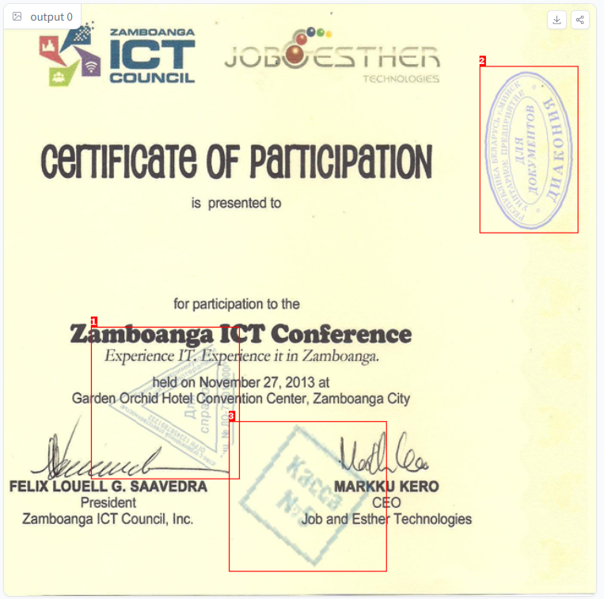
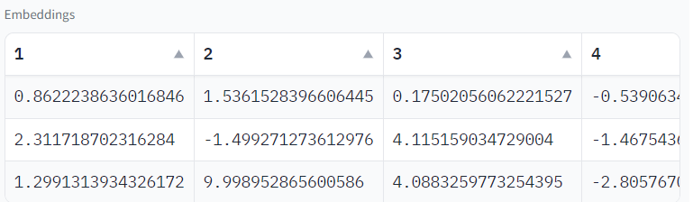
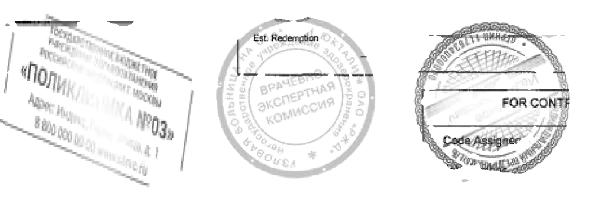
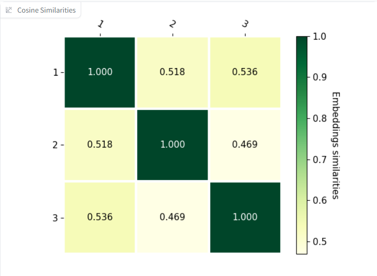

# Stamp2vec

This project is **WIP**. [Stamp2vec](https://gitlab.pg.innopolis.university/stamps-labs/stamp2vec) is a project which aims to build a stamp detection and feature extraction of stamps. The goal is to provide various end-to-end pipelines for stamp detection and stamp feature extraction. It contains implementation of papers [[1]](#1), [[2]](#2) and uses various frameworks [[3]](#3), [[4]](#4) for achieving high performance and accuracy on the task.

## Introduction

Stamp recognition is a challenging task due to the diverse designs, sizes, and colors of stamps and various informational noise (text, tables) on document scans. Traditional methods of identification involve manual inspection, which is time-consuming. This project aims to automate the stamp recognition process using computer vision.

## Methodology

The stamp recognition system follows the following steps:

Detection: One of the available YOLO models predicts bounding boxes of stamps on the image.

Segmentation (*optional*): Segmentation model highlight all the pixels belonging to a stamp, to get a better embedding on the next step.

Embeddings: One of the available embeddings models returns an array of values that best describes a particular stamp.

Classification: Embeddings of different stamps can be compared using methods such as cosine similarity.

## Technology

This project uses various frameworks and services. The ML models are built using PyTorch [[5]](#5), a popular open-source machine learning library. The app is built using Gradio [[6]](#6), a user-friendly platform that allows developers to quickly create customizable interfaces for their machine learning models. The API is built using FastAPI [[7]](#7), a modern web framework that offers high performance and scalability. Finally, the project is hosted on HuggingFace [[8]](#8), a leading platform for building and sharing AI models.

##Usage
 In order to use project, installing libraries is essential
 ```
 pip install -r requirements.txt
 ```
 One of the goals of the project is to provide simple interface for using trained models. Therefore, this project incorporates various pipelines written for each model which includes pre-processing, inference and postprocessing.
 ```python
 #import pipeline from the module
 from pipelines.detection.yolo_stamp import YoloStampPipeline
 from PIL import Image
 #initialize it with a path to a huggingface space
 pipe = YoloStampPipeline.from_pretrained("stamps-labs/yolo-stamp")
 #load PIL image
 img = Image.open("dataset_generation/images/images/img9.png")
 #Print the results of inference (coordinates in this case)
 print(pipe(img))
 ```

## Features

1. A [deployed app on HuggingFace](https://huggingface.co/spaces/stamps-labs/stamp2vec) with simple inference to test models. Functionallity includes: <br />

   1. Showing bounding boxes of stamps <br />
        
   2. Get stamps embeddings <br />
        
   3. (*optional*) Get segmented stamps <br />
        
   5. Show cosine similarity between all stamps on the document <br />
        

2. No 3rd party libraries for inference. <br />
   Lots of different libraries and frameworks are bad for versioning and usage. We had to overcome challenge of using less libraries for usage of this project therefore we have used torch JIT model compiler in order to make this project as lightweight as possible.

3. Pipelines for ML models. <br />
   Pipelines (*referenced above*) are: <br />
   1. Easy to use <br />
   2. Includes post- and pre-processing <br />
   3. Allows storing models on dedicated server <br />
   4. Backwards compatibility <br />
4. FastAPI server with endpoints: <br />

   1. `/bounding-boxes`
   2. `/image-w-boxes`
   3. `/embedding-from-copped`
   4. `/embeddings`
5. Good model performance
   1. Feature extraction model (dino-vits8) was trained using Triplet Loss and achieved **mAP@5 = 0.8**, **cmc@5=0.95**. 
   2. Dataset that was synthetically assembled for train and test data was extremelly complex and included a lot of artifacts, augmentations, stamp masks.
6. Various model presets
   During development of this project we trained and experimented with multiple different architectures as well as implemented a few papers in order to achieve the best results in terms of quality and performance. Thus, we have different models for each use case:
   1. Lightweight models for fast inference (Yolo-stamp, VAE)
   2. Heavier models for best results (YOLO v8, dino-vits8)


## Resources
 This project contains implementation of "Fast and Accurate Deep Learning Model for Stamps Detection for Embedded Devices" [[1]](#1) and incorporates techniques mentioned in "TVAE: Triplet-Based Variational Autoencoder using Metric Learning" [[2]](#2). <br />
 This project also uses Open-Metric-Learning framework [[3]](#3) for training the Deep metric learning models with Triplet Loss and Ultralytics framework [[4]](#4) for YoloV8 training. <br />
## For customer
All project artifacts(models, spaces, *datasets**) can be accessed on HuggingFace classroom [stamps-labs](https://huggingface.co/stamps-labs)
**in future*

## References
 <a id="1">[1]</a> Gayer, A., Ershova, D. & Arlazarov, V. Fast and Accurate Deep Learning Model for Stamps Detection for Embedded Devices. Pattern Recognit. Image Anal. 32, 772–779 (2022). https://doi.org/10.1134/S1054661822040046 <br />
 <a id="2">[2]</a>  Ishfaq, H., Hoogi, A., & Rubin, D.L. (2018). TVAE: Triplet-Based Variational Autoencoder using Metric Learning. ArXiv, abs/1802. 04403. https://doi.org/10.48550/arXiv.1802.04403 <br />
 <a id="3">[3]</a> https://github.com/OML-Team/open-metric-learning <br />
 <a id="4">[4]</a> https://github.com/ultralytics/ultralytics <br />
 <a id="5">[5]</a> https://github.com/pytorch/pytorch <br />
 <a id="6">[6]</a> https://github.com/gradio-app/gradio <br />
 <a id="7">[7]</a> https://github.com/tiangolo/fastapi <br />
 <a id="8">[8]</a> https://huggingface.co/ <br />