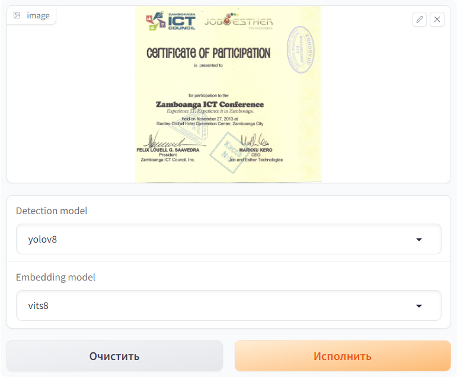
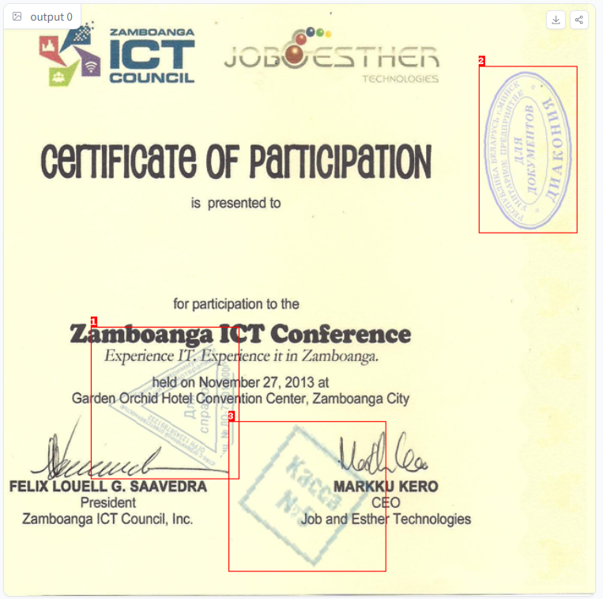
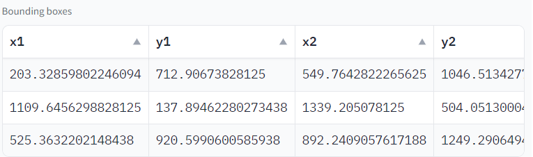
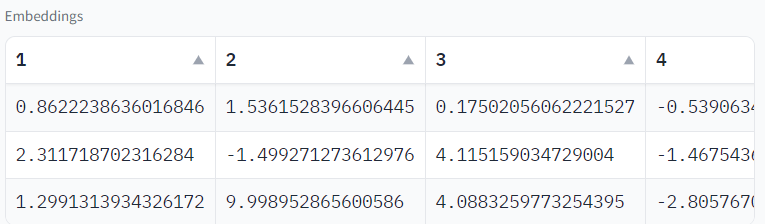
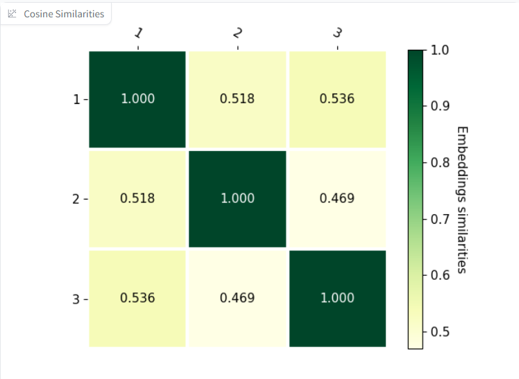

# Stamp-detection

This project aims to develop a system that utilizes computer vision techniques to recognize and classify stamps. The system takes an input image of a document that may contain stamps and performs various image processing and machine learning algorithms to identify and categorize stamps

## Introduction

Stamp recognition is a challenging task due to the diverse designs, sizes, and colors of stamps. Traditional methods of identification involve manual inspection, which is time-consuming. This project aims to automate the stamp recognition process using computer vision.

The system is designed to identify and categorize stamps based on their visual features, such as colors, shapes, and textual information. It utilizes state-of-the-art deep learning models trained on large stamp datasets to achieve high accuracy in stamp recognition.

## Methodology

The stamp recognition system follows the following steps:

Detection: One of fthe available YOLO models predicts bounding boxes of stamps on the image.

Segmentation (optional): Segmentation model highlight all the pixels belonging to a stamp, to get a better embedding on the next step.

Embeddings: One of the available embeddings models return an array of values that best describes a particular stamp.

Classification: Embeddings of different stamps can be compared using methods such as cosine similarity.

## Technology

This project utilizes cutting-edge technologies and frameworks to deliver a seamless user experience. The ML models are built using PyTorch, a popular open-source machine learning library. The app is built using Gradio, a user-friendly platform that allows developers to quickly create customizable interfaces for their machine learning models. The API is built using FastAPI, a modern web framework that offers high performance and scalability. Finally, the project is hosted on Hugging Face, a leading platform for building and sharing AI models.

## Features

1. An [app on Hugging Face](https://huggingface.co/spaces/stamps-labs/stamp2vec) to interface models. Functionallity includes:

   1. Upload document or choose one of the examples, choose one of available models
        
        *Upload document or choose one of the examples, choose one of available models*
   2. Show bounding boxes of stamps
        
   3. Get the coordinates of stamps
        
   4. Get stamps embeddings
        
   5. Show cosine similarity between all stamps on the document
        
2. Pipelines for ML models.

   1. Easy to use
   2. Includes post- and pre-processing
   3. Allows storing models on dedicated server
   4. Backwards compatibility
      Example:

   ```python
    from pipelines.detection.yolo_stamp import YoloStampPipeline
    from PIL import Image

    pipe = YoloStampPipeline.from_pretrained("stamps-labs/yolo-stamp")

    img = Image.open("dataset_generation/images/images/img9.png")

    print(pipe(img))
   ```
3. FastAPI server with endpoints:

   1. `/bounding-boxes`
   2. `/image-w-boxes`
   3. `/embedding-from-copped`
   4. `/embeddings`

## Usage
